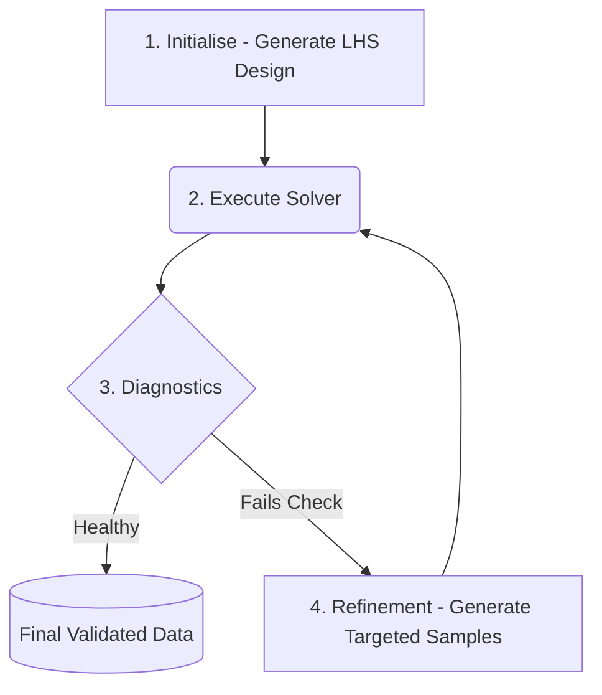

# Automated Optimisation

The `optimise` method allows you to run a complete "Active Learning" loop. DigiQual will generate an initial design, run your external solver, check the results, and automatically add new points where the model is weak. 

## The Active Learning Lifecycle

When you trigger the `optimise` method, DigiQual acts as an orchestrator, completing the following active learning loop until statistical requirements are satisfied.



### Breakdowns of the Steps
1. **Initialisation**: If you have no existing data, DigiQual generates an initial batch of input coordinates using Latin Hypercube Sampling (LHS) to ensure a good spread across your variable ranges.
2. **Execution**: It writes these coordinates to a temporary CSV file and commands your external solver to run.
3. **Diagnostics (Sense)**: Once the results are back, DigiQual runs statistical checks. It looks for "gaps" in your input coverage and measures "model uncertainty" using a technique called Bootstrap Query-by-Committee.
4. **Refinement (Decide & Act)**: If the diagnostics fail, DigiQual generates *targeted* new samples exactly where the model needs them most (e.g., in the middle of an empty gap, or in highly uncertain regions) and repeats the loop.

## Connecting Your External Solver

To automate this process, DigiQual needs to communicate with your external software (like MATLAB, Ansys, or a custom Python script). It does this using a simple file-based contract via a command string.

Your command string must contain two special placeholders: `{input}` and `{output}`.

* **`{input}`**: DigiQual will replace this with the path to a CSV file it creates. This CSV contains the input variables for the current batch of simulations.
* **`{output}`**: DigiQual will replace this with the path where it *expects* your solver to save the final results as a CSV.

### The "Wrapper" Concept

Most heavy physics solvers don't natively read and write CSVs in exactly the way DigiQual expects. In real life, you will usually write a small "wrapper script" (e.g., `run_my_model.py` or `run_my_model.bat`). See [Appendix](#sec-appendix) for full examples in Python and MATLAB.

### Key Features
- **Batch Processing:** A critical detail is that the `{input}` CSV does not contain just one simulation point. It contains an **entire batch** of points (determined by `n_start` or `n_step`). Your wrapper script must loop over each row in the CSV, execute the solver for that set of inputs, record the result, and finally save all results to the `{output}` CSV.
- **Handling Failures (Graveyard):** If the external solver crashes or fails to converge for a specific input row, your wrapper should leave the outcome column blank (or insert `NaN`) for that row. DigiQual will detect this and automatically add those coordinates to a "graveyard", ensuring it never tries to sample that exact region again!

## The Auto-Pilot Workflow

Let's walk through setting up a complete optimisation loop.

### 1. Define a "Mock" Solver

For this tutorial, we will use a Python one-liner as our "solver" instead of a complex physics engine. We use `python -c` to run this as if it were an external Command Line Interface (CLI) tool.

Notice how the `SOLVER_CMD` utilises the `{input}` and `{output}` placeholders.

```{python}
import sys

# A complex, non-linear physics model to trigger multiple optimisation loops
SOLVER_CMD = (
    f"{sys.executable} -c "
    "'import pandas as pd, numpy as np; "
    'df=pd.read_csv("{input}"); '
    'df["Signal"] = 5 + df["Length"] ** 3 + (df["Length"] * np.random.normal(0, 1, len(df))); '
    'df.to_csv("{output}", index=False)\''
)
```

### 2. Configure the Study

We define our input variables and the ranges we want to explore.

```{python}
from digiqual.core import SimulationStudy

# Define inputs ranges
ranges = {"Length": (0.0, 5.0), "Angle": (-45.0, 45.0)}

# Initialise
study = SimulationStudy(input_cols=["Length", "Angle"], outcome_col="Signal")
```

### 3. Run Optimisation

This single command handles the entire Active Learning loop:

```{python}
study.optimise(
    command=SOLVER_CMD,
    ranges=ranges,
    n_start=20,  # Initial batch size
    n_step=10,  # Refinement batch size
    max_iter=5,  # Safety limit for the loop
    max_hours=1.5,  # Time limit to safely stop after 1.5 hours
)
```

### 4. View Results

Once the loop finishes, `study.data` contains all the valid simulation results accumulated across all refinement iterations.

```{python}
# | label: fig-optimisation-results
# | fig-cap: "Reliability Analysis Results"
# | layout-ncol: 1
print(f"Total Simulations Run: {len(study.data)}")
# We can evaluate the PoD mapping out the Nuisance Angle!
_ = study.pod(poi_col="Length", nuisance_col=["Angle"], threshold=20)
study.visualise()
```


## Appendix: Real-World Wrapper Examples {#sec-appendix}

When connecting DigiQual to external engines like MATLAB or Ansys, you will write wrapper scripts. The script reads the input coordinates generated by DigiQual, triggers the solver, and writes an output CSV. See below for examples.

### Example A: Python Wrapper

```{python}
# | eval: false
import sys, pandas as pd
from beam_model import simulate_beam

def main():
    input_csv, output_csv = sys.argv[1], sys.argv[2]
    df = pd.read_csv(input_csv)
    
    # Run proprietary solver for each row
    df["Signal"] = df.apply(lambda row: simulate_beam(row["Length"], row["Angle"]), axis=1)
    
    # Save back for DigiQual
    df.to_csv(output_csv, index=False)

if __name__ == "__main__":
    main()
```
*Run via: `SOLVER_CMD = "python python_wrapper.py {input} {output}"`*

---

### Example B: Connecting to MATLAB

MATLAB can be run in "batch" mode from the command line, making it perfect for automated Active Learning.

**1. The Existing MATLAB Solver (`my_matlab_solver.m`)**
Your existing MATLAB function that does the heavy lifting.

```matlab
% my_matlab_solver.m
function signal = my_matlab_solver(L, theta)
    % A complex simulation script
    signal = (L^3) * 0.5 + theta;
end
```

**2. The MATLAB Wrapper Function (`matlab_wrapper.m`)**
We write a top-level MATLAB function that reads the CSV, iterates over the design points, and writes the output CSV.

```matlab
% matlab_wrapper.m
function matlab_wrapper(input_csv, output_csv)
    % 1. Read the input coordinates generated by DigiQual
    df = readtable(input_csv);

    % 2. Initialise an array to hold our results
    num_rows = height(df);
    signal_results = zeros(num_rows, 1);

    % 3. Run the solver for each row
    for i = 1:num_rows
        L = df.Length(i);
        theta = df.Angle(i);
        signal_results(i) = my_matlab_solver(L, theta);
    end

    % 4. Append the results to the table and save
    df.Signal = signal_results;
    writetable(df, output_csv);

    % Exit MATLAB to hand control back to DigiQual
    exit;
end
```

**3. The DigiQual Command**
We construct a command that launches MATLAB without the graphical interface (`-batch`), tells it to run our wrapper, and safely injects the `{input}` and `{output}` paths as strings.

```{python}
# | eval: false
# In your main study script
SOLVER_CMD = "matlab -batch \"matlab_wrapper('{input}', '{output}')\""
# study.optimise(command=SOLVER_CMD, ...)
```
