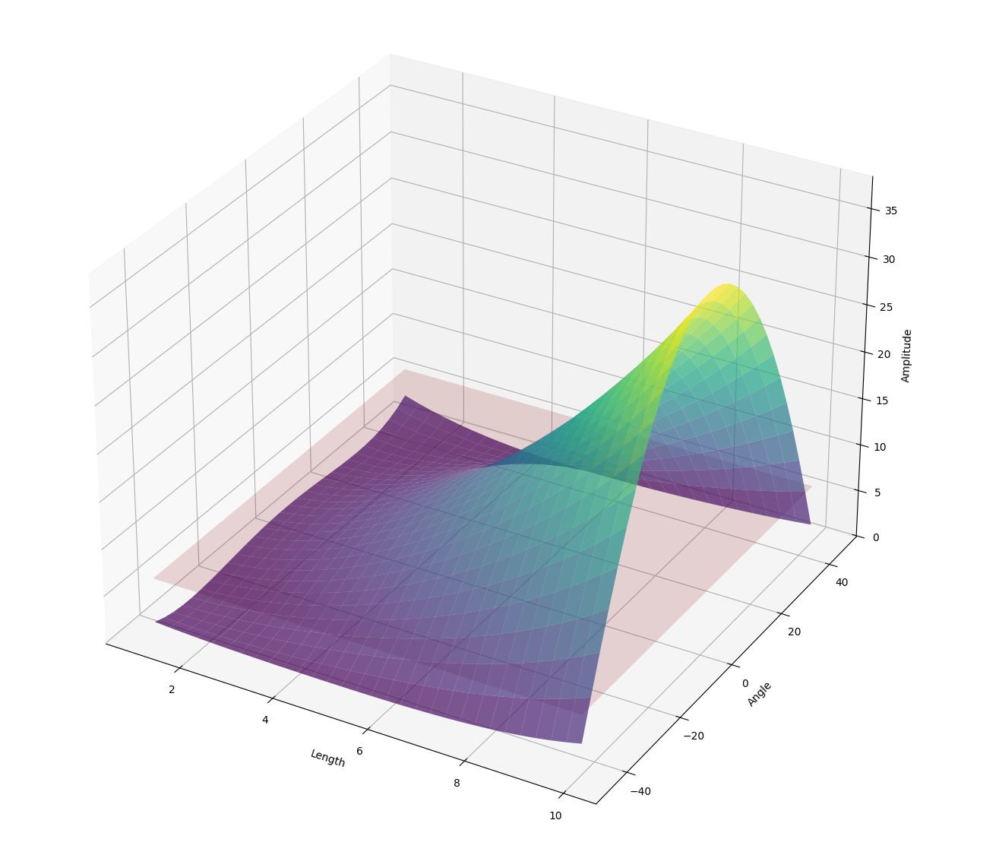

::: {.grid .align-items-center}

::: {.g-col-12 .g-col-md-7}
## Advanced NDE Reliability Engineering

`digiqual` is a specialized statistical library developed for Non-Destructive Evaluation (NDE) professionals. It provides a rigorous framework for conducting Model-Assisted Probability of Detection (MAPOD) studies, utilizing the **Generalized $\hat{a}$-versus-$a$ Method**.

The package is designed to provide robust, conservative reliability assessments in complex scenarios where traditional linear regression, homoscedasticity, and normality assumptions are statistically invalid.
:::

::: {.g-col-12 .g-col-md-5 .text-center}
{.rounded .shadow .border .img-fluid width="100%"}
:::

:::


## Core Capabilities

::: {.grid}

::: {.g-col-12 .g-col-md-4}
### 🔬 Statistical Generalisation
Supports non-linear signal responses through automated cross-validation model selection and treats noise as a heteroscedastic, non-Gaussian process.
:::

::: {.g-col-12 .g-col-md-4}
### 🔄 Adaptive Optimisation
Utilises an Active Learning lifecycle to orchestrate automated loops of initialisation, execution, and diagnostic-driven refinement.
:::

::: {.g-col-12 .g-col-md-4}
### 💻 Multimodal Execution
Integrates with external physics solvers via specialised Executors for Python, MATLAB, and Command Line Interfaces (CLI), facilitating process isolation.
:::

:::


## Deployment Architectures

::: {.panel-tabset}

### Python Package
For engineers developing custom reliability pipelines or integrating PoD into large-scale Monte Carlo simulation environments.

```bash
uv add digiqual
```

::: {.callout-tip}
If you are completely new, head over to the **[Installation Guide](docs/install.qmd)** for setup details, & the **[Quick Start Guide](docs/qs_class.qmd)** for an intro to the SimulationStudy Class.
:::

### Python GUI
A browser-based graphical user interface (GUI) built with a modern design system, providing a visual workflow for design, diagnostics, and analysis.

`uv` users can use the `uvx` shortcut to load the app directly:
```bash
uvx -v digiqual@latest
```

Alternatively, once the package is installed, the GUI can be launched from a python command:
```python
# Launch the local application
from digiqual import dq_ui

dq_ui()
```

::: {.callout-tip}
For more information about the GUI, head over to the **[Launch the App](docs/gui.qmd)** page.
:::

### Standalone Application
We are actively developing standalone, double-click executables for both Windows and macOS. In the near future, you or your colleagues will be able to run the complete DigiQual toolkit as a standard desktop application, without needing to install Python, manage virtual environments, or touch a command line.

:::

## References

This package implements methods described in:

**Malkiel, N., Croxford, A. J., & Wilcox, P. D. (2025).** A generalized method for the reliability assessment of safety–critical inspection.
Proceedings of the Royal Society A, 481: 20240654. https://doi.org/10.1098/rspa.2024.0654

**Malkiel, N., Croxford, A. J., & Wilcox, P. D. (2026).** A comprehensive investigation of flexible and multi-dimensional simulation-based PoD analysis
NDT & E International, 159: 103596. https://doi.org/10.1016/j.ndteint.2025.103596
